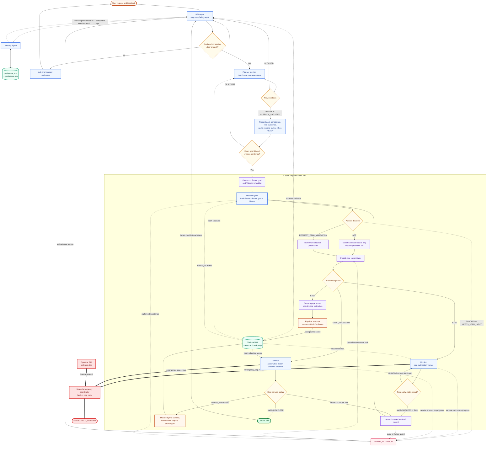

# RoboPref
A robotic agent system, enhancing human-robot interaction capabilities by leveraging interactive history and experiences.

Version: `2.2.1`

## System Workflow

PrefMem is implemented as a preference-aware, task-level receding-horizon
controller. Five model-facing agents have distinct roles: HRI, Planner, Memory,
Monitor, and Validator. A deterministic `PrefMemRuntime` and
`RecedingHorizonController` own the authoritative goal, state transitions,
execution history, task identities, publication, temporal evidence rules, and
loop guards.

The implemented workflow is:

1. The HRI Agent receives the user's message, a current camera frame, and the
   authoritative runtime state. It may retrieve relevant preferences and asks a
   focused clarification when the requested physical outcome or a constraint is
   ambiguous. Preference writes require explicit future-facing intent or an
   affirmative answer to a dedicated memory-consent question.
2. Once the intent is clear, the runtime captures a fresh frame and asks the
   stateless Planner for a non-executable preview. The HRI presents the precise
   goal, constraints, final expected observations, and, for a `READY` preview,
   a nominal task outline.
3. Execution starts only after the user confirms the exact staged goal ID and
   revision. The Validator first compiles a detailed visual checklist against a
   confirmation frame. The high-level goal and checklist are then frozen for the
   run; the nominal preview is not frozen as an action queue.
4. On every planning cycle, the Planner receives a fresh frame, the frozen goal,
   the trigger, terminal execution history, and any operator guidance. It may
   return one to three candidate tasks, but the controller publishes only the
   first one, giving an execution horizon of one.
5. For a normal step, the runtime either shows that single instruction on the
   camera page for a human (`--executor human`, the default) or sends it to the
   MuJoCo Panda execution agent (`--executor mujoco`). In simulation, Gemma 4
   compiles the instruction to a constrained symbolic pick/place program, SAM
   3.1 segments its source and target, synchronized depth grounds both in 3D,
   and a deterministic IK/position controller executes the safe waypoint
   sequence. Monitor remains the authority for post-motion task completion.
6. When Planner requests final validation, Validator evaluates the frozen
   checklist over one or more fresh views. Host code derives `COMPLETE`,
   `INCOMPLETE`, or `NEEDS_EVIDENCE`; incomplete work is replanned, while missing
   visual evidence asks the operator to move only the camera.
7. Model/service errors, no-progress timeouts, Planner questions or blockers, and
   loop guards enter `NEEDS_ATTENTION`. HRI can explain the exact reason and, when
   applicable, resume the current publication or replan with guidance. A visual
   emergency request or the GUI software-stop control instead latches the
   terminal `EMERGENCY_STOPPED` state.

### General workflow

Solid arrows show control flow, dashed arrows show optional context, visual
evidence, or recovery, and thick paths show emergency-stop propagation.
Orange nodes are people or operator actions, blue nodes are model agents,
purple nodes are deterministic host operations, green cylinders are data or
camera surfaces, amber diamonds are decisions, rose nodes require attention,
bright green is successful completion, and red belongs to the emergency path.



### Detailed workflow

```mermaid
flowchart TD
    subgraph INTERACTION["1 · Interaction and preference memory"]
        USER(["User / operator"]) --> FRONTEND["Terminal CLI or operator GUI"]
        FRONTEND --> HRI["HRI Agent"]
        CAMERA[("Webcam server<br/>stream + snapshot + task API")] -.->|current HRI-turn frame| HRI
        RUNTIME_STATE[("Authoritative runtime state<br/>goal, task, history, validation, attention")] -.->|injected on every model call| HRI

        HRI -.->|optional RETRIEVE REQUEST| MEMORY["Memory Agent"]
        HRI -.->|MUTATE only after explicit intent or dedicated consent| MEMORY
        MEMORY --> MEMORY_KIND{"Read or mutation?"}
        MEMORY_KIND -->|Either path| RETRIEVE["Semantic retrieval<br/>mandatory before every mutation"]
        RETRIEVE <--> PREF_STORE[("Preference text + normalized embeddings<br/>preference.json / preference.npy")]
        RETRIEVE --> MEMORY_GATE{"Semantic relevance and<br/>mutation-target gate"}
        MEMORY_GATE -->|Read, no-op, ambiguous, or not found| MEMORY_RESULT["Return structured result"]
        MEMORY_GATE -->|One justified write| MEMORY_WRITE["Remember, update, or forget<br/>at most one preference"]
        MEMORY_WRITE --> PREF_STORE
        MEMORY_WRITE --> MEMORY_RESULT
        MEMORY_RESULT -.-> HRI

        HRI --> INTENT{"Physical outcome and<br/>constraints sufficiently clear?"}
        INTENT -->|No| CLARIFY["Ask one focused clarification"]
        CLARIFY --> USER
    end

    subgraph CONFIRMATION["2 · Scene-grounded preview and exact confirmation"]
        INTENT -->|Yes| PREVIEW_REQUEST["Runtime request_goal_preview"]
        CAMERA -.->|fresh snapshot| PREVIEW_REQUEST
        PREVIEW_REQUEST --> PLANNER_PREVIEW["Planner PREVIEW<br/>stateless and scene-grounded"]
        PLANNER_PREVIEW --> PREVIEW_STATUS{"READY, ALREADY_SATISFIED,<br/>or BLOCKED?"}
        PREVIEW_STATUS -->|BLOCKED| PREVIEW_BLOCK["Return blocker;<br/>nothing is confirmable"]
        PREVIEW_BLOCK --> HRI
        PREVIEW_STATUS -->|READY or ALREADY_SATISFIED| STAGE["Stage GoalContract candidate<br/>with host goal ID + revision"]
        STAGE --> PRESENT["HRI presents exact goal, constraints, final observations,<br/>and a nominal outline when READY"]
        PRESENT --> CONFIRM{"User confirms exact<br/>goal ID + revision?"}
        CONFIRM -->|No or revise| DECLINE["Keep for discussion;<br/>a new preview replaces it"]
        DECLINE --> HRI
        CONFIRM -->|Yes| CONFIRM_FRAME["Capture confirmation frame"]
        CAMERA -.->|snapshot| CONFIRM_FRAME
        CONFIRM_FRAME --> COMPILE["Validator compiles detailed criteria<br/>for every frozen broad outcome"]
        COMPILE -.->|error| COMPILE_ERROR["Return tool error;<br/>staged goal remains retryable"]
        COMPILE_ERROR --> HRI
        COMPILE -->|valid checklist| FROZEN["Authorize immutable GoalContract<br/>and freeze ValidationContract"]
    end

    subgraph EXECUTION["3 · Receding-horizon planning, publication, and step monitoring"]
        FROZEN --> CAPTURE_CYCLE["Capture fresh cycle frame"]
        CAMERA -.->|snapshot after the triggering event| CAPTURE_CYCLE
        CAPTURE_CYCLE --> CYCLE_REQUEST["Build PlannerCycleRequest<br/>frozen goal + trigger + terminal history + guidance"]
        EXEC_HISTORY[("Host-owned terminal<br/>execution history")] -.-> CYCLE_REQUEST
        CYCLE_REQUEST --> PLANNER_CYCLE["Planner PLAN_CYCLE<br/>returns decision + horizon of at most 3"]
        PLANNER_CYCLE -.->|model, schema, or cycle error| ATTENTION
        PLANNER_CYCLE --> PLANNER_DECISION{"Planner decision"}

        PLANNER_DECISION -->|ACT| REPEAT_GUARD{"First task repeated after<br/>too many identical failures?"}
        REPEAT_GUARD -->|Yes| ATTENTION
        REPEAT_GUARD -->|No| TAKE_FIRST["Controller selects candidate_tasks[0]<br/>and discards the prediction tail"]
        TAKE_FIRST --> BUILD_STEP["Assign trusted cycle, step,<br/>criterion, and publication IDs"]
        PLANNER_DECISION -->|REQUEST_FINAL_VALIDATION| BUILD_FINAL["Build one FINAL_VALIDATION publication<br/>from frozen broad outcomes"]
        PLANNER_DECISION -->|BLOCKED or NEEDS_USER_INPUT| ATTENTION
        BUILD_STEP --> PUBLISH["Publish ControllerDisplay<br/>PUT /api/task"]
        BUILD_FINAL --> PUBLISH
        PUBLISH -.->|publication failure| ATTENTION
        PUBLISH --> PHASE{"Task phase"}

        PHASE -->|STEP| STEP_PAGE["Publish exactly one<br/>physical task and expected observations"]
        STEP_PAGE --> HUMAN_EXECUTOR["Human or MuJoCo Panda<br/>performs the current task"]
        HUMAN_EXECUTOR -->|changes physical scene| CAMERA
        PHASE -->|STEP only| MONITOR["Monitor service polls<br/>post-publication frames"]
        CAMERA -.->|newer visual evidence| MONITOR
        MONITOR -.->|service error or no-progress timeout| ATTENTION
        MONITOR --> MONITOR_OUTPUT["Criterion states +<br/>ONGOING / SUCCESS / FAIL"]
        MONITOR_OUTPUT ==>|emergency_stop = true| ESTOP
        MONITOR_OUTPUT --> EVIDENCE_FENCE["Reject stale/wrong-publication evidence;<br/>apply confirmation and stability thresholds"]
        EVIDENCE_FENCE --> MONITOR_STATE{"Accepted result"}
        MONITOR_STATE -->|ONGOING or terminal result not stable yet| MONITOR
        MONITOR_STATE -->|stable SUCCESS| RECORD_SUCCESS["Append SUCCESS record<br/>and reset consecutive-failure count"]
        MONITOR_STATE -->|stable FAIL| RECORD_FAIL["Append FAIL record<br/>with observation + failure reason"]
        RECORD_SUCCESS --> EXEC_HISTORY
        RECORD_FAIL --> EXEC_HISTORY
        RECORD_SUCCESS --> LOOP_GUARD{"Cycle or consecutive-failure<br/>limit reached?"}
        RECORD_FAIL --> LOOP_GUARD
        LOOP_GUARD -->|No| CAPTURE_CYCLE
        LOOP_GUARD -->|Yes| ATTENTION
    end

    subgraph VALIDATION["4 · Independent, multi-view final validation"]
        PHASE -->|FINAL_VALIDATION only| FINAL_PAGE["Browser: keep objects unchanged;<br/>move only the camera as requested"]
        PHASE -->|FINAL_VALIDATION only| VALIDATOR["Validator service polls fresh views<br/>against the frozen detailed checklist"]
        CAMERA -.->|post-publication views| VALIDATOR
        VALIDATOR -.->|service error or no-progress timeout| ATTENTION
        VALIDATOR --> VALIDATOR_OUTPUT["Detailed MET / NOT_MET / UNKNOWN<br/>with visible evidence"]
        VALIDATOR_OUTPUT ==>|emergency_stop = true| ESTOP
        VALIDATOR_OUTPUT --> ACCUMULATE["Accumulate ordered criterion evidence<br/>across views for this publication"]
        ACCUMULATE --> BROAD_REPORT["Host aggregates detailed criteria<br/>to the frozen broad checklist"]
        BROAD_REPORT --> VALIDATION_STATUS{"Host-derived status"}

        VALIDATION_STATUS -->|NEEDS_EVIDENCE| EVIDENCE_REQUEST["Notify HRI/UI of exact UNKNOWN items"]
        EVIDENCE_REQUEST --> CAMERA_ONLY["Operator moves only the camera;<br/>scene objects remain unchanged"]
        FINAL_PAGE --> CAMERA_ONLY
        CAMERA_ONLY --> CAMERA

        VALIDATION_STATUS -->|COMPLETE or INCOMPLETE| VALIDATION_STABLE{"Required repeated evidence<br/>is temporally stable?"}
        VALIDATION_STABLE -->|No| VALIDATOR
        VALIDATION_STABLE -->|Yes: COMPLETE| COMPLETE(["COMPLETE"])
        VALIDATION_STABLE -->|Yes: INCOMPLETE| RECORD_VALIDATION_FAIL["Append FINAL_VALIDATION_FAIL<br/>with unmet-outcome evidence"]
        RECORD_VALIDATION_FAIL --> EXEC_HISTORY
        RECORD_VALIDATION_FAIL --> LOOP_GUARD
        COMPLETE -->|overall sentence + full broad checklist| HRI
    end

    subgraph RECOVERY["5 · Attention and operator-controlled recovery"]
        ATTENTION["NEEDS_ATTENTION<br/>system error · no progress · blocker · question · loop guard"]
        ATTENTION -->|exact reason + runtime state| HRI
        HRI --> RECOVERY_CHOICE{"Authorized next action"}
        RECOVERY_CHOICE -.->|Resume same task when one exists| RESUME["Capture frame and mint a new<br/>attempt publication ID"]
        CAMERA -.->|fresh resume frame| RESUME
        RESUME -.-> PUBLISH
        RECOVERY_CHOICE -.->|Replan with guidance| REPLAN_FRAME["Retire the paused observation job<br/>and capture one fresh replan frame"]
        CAMERA -.->|fresh replan frame| REPLAN_FRAME
        REPLAN_FRAME --> INTERRUPT["Append INTERRUPTED record<br/>if a task existed"]
        INTERRUPT --> EXEC_HISTORY
        INTERRUPT -.-> CYCLE_REQUEST
        RECOVERY_CHOICE -->|Await answer or authority| USER
    end

    GUI_STOP["Operator GUI<br/>software-stop control"] ==>|manual stop request| ESTOP["Shared EmergencyStopCoordinator<br/>atomically latches and calls hook once"]
    ESTOP -.-> HOOK["emergency_stop(reason)<br/>placeholder integration hook"]
    ESTOP ==> EMERGENCY_STOPPED(["EMERGENCY_STOPPED<br/>stop services and further publication"])

    classDef human fill:#fff7ed,stroke:#c2410c,color:#7c2d12,stroke-width:2px;
    classDef agent fill:#eff6ff,stroke:#2563eb,color:#1e3a8a,stroke-width:2px;
    classDef host fill:#f5f3ff,stroke:#7c3aed,color:#4c1d95,stroke-width:2px;
    classDef data fill:#ecfdf5,stroke:#059669,color:#064e3b,stroke-width:2px;
    classDef decision fill:#fffbeb,stroke:#d97706,color:#78350f,stroke-width:2px;
    classDef attention fill:#fff1f2,stroke:#e11d48,color:#881337,stroke-width:2px;
    classDef terminal fill:#dcfce7,stroke:#15803d,color:#14532d,stroke-width:3px;
    classDef safety fill:#fee2e2,stroke:#dc2626,color:#7f1d1d,stroke-width:3px;

    class USER,HUMAN_EXECUTOR,CAMERA_ONLY human;
    class HRI,MEMORY,RETRIEVE,MEMORY_RESULT,MEMORY_WRITE,CLARIFY,PLANNER_PREVIEW,PRESENT,COMPILE,PLANNER_CYCLE,MONITOR,VALIDATOR agent;
    class FRONTEND,PREVIEW_REQUEST,STAGE,DECLINE,CONFIRM_FRAME,FROZEN,CAPTURE_CYCLE,CYCLE_REQUEST,TAKE_FIRST,BUILD_STEP,BUILD_FINAL,PUBLISH,STEP_PAGE,EVIDENCE_FENCE,RECORD_SUCCESS,RECORD_FAIL,FINAL_PAGE,EVIDENCE_REQUEST,ACCUMULATE,BROAD_REPORT,RECORD_VALIDATION_FAIL,RESUME,REPLAN_FRAME,INTERRUPT host;
    class CAMERA,RUNTIME_STATE,PREF_STORE,EXEC_HISTORY data;
    class MEMORY_KIND,MEMORY_GATE,INTENT,PREVIEW_STATUS,CONFIRM,PLANNER_DECISION,REPEAT_GUARD,PHASE,MONITOR_STATE,LOOP_GUARD,VALIDATION_STATUS,VALIDATION_STABLE,RECOVERY_CHOICE decision;
    class PREVIEW_BLOCK,COMPILE_ERROR,ATTENTION attention;
    class COMPLETE terminal;
    class GUI_STOP,ESTOP,HOOK,EMERGENCY_STOPPED safety;
```



The confirmed goal remains fixed while the controller repeatedly plans from a
fresh frame, publishes one task, and uses fenced visual evidence to decide what
comes next. Physical task execution can be delegated to the human camera-page
operator or to the MuJoCo Panda execution agent. The latter is an explicit
language/perception/controller workaround, not a learned VLA policy; the
execution boundary remains ready for a future VLA adapter. `emergency_stop()`
is a logging-only placeholder, not a safety-rated or hardware emergency stop.

## Quickstart

### Clone the repository

```bash
git clone https://github.com/KasLoot/RoboPref.git
cd RoboPref
uv sync
```

### Serve a Reasoning VLM using vLLM

#### Install vLLM

```bash
workspace=<path-to-workspace>
mkdir -p $workspace/vllm
cd $workspace/vllm
uv venv -p 3.12
source .venv/bin/activate

# CUDA 13.0
uv pip install vllm --extra-index-url https://wheels.vllm.ai/0.25.1/cu130 --extra-index-url https://download.pytorch.org/whl/cu130 --index-strategy unsafe-best-match

```

#### Download VLM model: Gemma-4-26B-A4B-it
```bash
mkdir -p $workspace/models/gemma-4-26B-A4B-it

hf download google/gemma-4-26B-A4B-it --local-dir $workspace/models/gemma-4-26B-A4B-it
```

#### Run vLLM server
- You will need a GPU with at least 80GB of VRAM (e.g., A100 80GB, H100 80GB, or RTX Pro 6000 Blackwell).
- You may use a quantized model to reduce VRAM requirements, but this may affect reasoning performance.

```bash
VLLM_USE_FLASHINFER_SAMPLER=0 \
vllm serve /workspace/models/gemma-4-26B-A4B-it \
  --max-model-len 32768 \
  --enable-per-request-metrics \
  --gpu-memory-utilization 0.95 \
  --enable-auto-tool-choice \
  --tool-call-parser gemma4 \
  --reasoning-parser gemma4 \
  --mm-processor-kwargs '{"max_soft_tokens": 560}' \
  --moe-backend triton

# Supported values: 70, 140, 280 (default), 560, 1120 tokens per image.
```

#### Forward the vLLM server port to your local machine

```bash
ssh -N -L 8000:127.0.0.1:8000 \
  -p 17210 -i ~/.ssh/id_ed25519 \
  root@103.196.86.101
```

### Serve Embedding model using vLLM

```bash
mkdir -p $workspace/models/embeddinggemma-300m
hf download google/embeddinggemma-300m --local-dir $workspace/models/embeddinggemma-300m

# RTX 4070 Ti with 12GB VRAM, using bfloat16 precision and 70% GPU memory utilization.
vllm serve $workspace/models/embeddinggemma-300m --dtype bfloat16 \
  --gpu-memory-utilization 0.70 \
  --hf-overrides '{"matryoshka_dimensions":[768]}' \
  --port 8080

# On RTX 5090
mkdir -p serve_embeddinggemma
cd serve_embeddinggemma
uv venv -p 3.12
source .venv/bin/activate
# CUDA 13.0
uv pip install vllm --extra-index-url https://wheels.vllm.ai/0.25.1/cu130 --extra-index-url https://download.pytorch.org/whl/cu130 --index-strategy unsafe-best-match

VLLM_USE_FLASHINFER_SAMPLER=0 \
vllm serve /workspace/models/embeddinggemma-300m \
  --runner pooling \
  --dtype bfloat16 \
  --gpu-memory-utilization 0.20 \
  --hf-overrides '{"matryoshka_dimensions":[768]}' \
  --port 8080
```

### Run the RoboPref agent

#### Webcam streaming

Stream camera 0 to a browser on this machine:

```bash
uv sync
uv run stream_camera
```

Keep this process running and open `http://127.0.0.1:1234`. The page shows the
live feed and, below it, the controller's single current task, expected visual
observations, monitor observation, and execution state. Restart `stream_camera`
after updating PrefMem so the page and `/api/task` use the matching contracts.

The operating system is detected automatically; use `--system` to select one explicitly.

Useful options:

```bash
# Find an available camera index
uv run stream_camera --list-cameras

# Select camera 1 and use Windows DirectShow
uv run stream_camera --system windows --camera 1 --backend dshow

# Use Linux V4L2 with MJPEG transport
uv run stream_camera --system linux

# Make the stream available on the local network (no authentication)
uv run stream_camera --host 0.0.0.0
```

#### Open another terminal to run the RoboPref agent:
```bash
uv run prefmem \
  --model-config vllm \
  --camera-base-url http://127.0.0.1:1234 \
  --memory-store-path ./memory_store_test
```

#### MuJoCo Panda execution agent

The simulation mode does not need `stream_camera`; its fixed RGB-D task camera
feeds HRI, Planner, Monitor, Validator, SAM grounding, and the execution agent
from one synchronized MuJoCo scene. Keep the forwarded services available at:

- Gemma 4: `http://localhost:8000/v1`
- SAM 3.1: `http://127.0.0.1:9000`
- EmbeddingGemma: `http://localhost:8080/v1`

The SAM server generated by `serve_sam3.bash` now returns a lossless PNG mask
for every detection in `mask_png_base64`; restart that service after updating
the repository. Then run:

```bash
uv sync
uv run prefmem \
  --model-config vllm \
  --model-provider vllm \
  --executor mujoco \
  --sam-base-url http://127.0.0.1:9000 \
  --memory-store-path ./memory_store_test
```

The scene starts with red, green, and blue cubes at randomized, separated
positions in the Panda workspace. Yellow, purple, and orange cubes wait on the
dark `items_area` outside robot reach and outside the fixed task-camera view.
The fixed task camera is oblique so the side face of every cube remains visible
in a vertical stack. It excludes the Panda visual-mesh group only from the
offscreen frames consumed by Monitor and the other visual agents. The separate
interactive viewer defaults to a freely navigable overview with the complete
Panda and stored items visible. Select MuJoCo's fixed `task_camera`, or start
with `--simulation-viewer-camera task`, when you want to inspect the Monitor
view; switch back to the free camera to orbit, pan, and arrange disturbances.
Use MuJoCo's body-selection and perturbation controls to drag a stored cube into
the workspace while execution is running. The open-set goal contract for a
request such as “Stack the blocks” includes matching blocks present at final
validation, even if they arrived after confirmation. A confirmed count increase
during motion cancels to a safe hold before triggering a fresh Planner cycle.
Stack collapse remains ordinary visual failure evidence for Monitor and is also
handled by the next receding-horizon cycle.

The Panda controller uses a minimum-jerk joint trajectory capped at 0.6 rad/s
and 1.2 rad/s\u00b2 by default. Model-based gravity feed-forward holds each IK
target without accumulating integral trim, and a waypoint is complete only
after both joint error and joint velocity remain within their settling limits.
This keeps grasp and placement approaches deliberate and prevents the actuator
setpoint from winding past the destination.

Useful options:

```bash
# Reproducible placement without an interactive viewer
uv run prefmem --executor mujoco --simulation-seed 7 --no-simulation-viewer

# Change square RGB-D resolution (128-1024 pixels) and render rate
uv run prefmem --executor mujoco --simulation-render-size 320 --simulation-render-hz 8

# Include inference lifecycle and latency in addition to assessment summaries
uv run prefmem --executor mujoco --monitor-events verbose

# Inspect the exact fixed camera used by Monitor (this view does not orbit)
uv run prefmem --executor mujoco --simulation-viewer-camera task
```

MuJoCo mode enables concise live Monitor events by default. Each assessment
shows its frame, status, criterion states, visible observation, executor state,
controller disposition, and confirmation streak. Use `--monitor-events off` to
silence them or `--monitor-events verbose` to include inference start,
completion, and latency. Event delivery is bounded and best-effort; it is
telemetry only and cannot change controller state.

The simulated software stop cancels motion and commands the current joint and
gripper positions, but it is not a safety-rated stop and must not be treated as
one on physical hardware.

#### Operator GUI

With the camera server, Gemma 4 tunnel, and EmbeddingGemma server running, start
the local operator console in place of the terminal `prefmem` process:

```bash
uv run ui --memory-store-path ./memory_store_test
```

Open `http://127.0.0.1:8090`. The console combines the live camera feed, HRI
conversation, exact goal confirmation, current execution state, validation
results, history, and service health. It listens on loopback only and uses port
8090 so it does not conflict with EmbeddingGemma on port 8080. The console has
no login and exposes a shared transcript and robot controls, so do not publish,
reverse-proxy, or tunnel port 8090 without adding authentication and operator
arbitration.

On desktop, the workspace is split evenly: the live camera, Monitor details,
and compact agent-status cards are on the left, while the full-height chat is
on the right. User and HRI messages use opposing bubbles; streamed reasoning,
tool calls, tool results, and other internal output stay inside collapsed
**Internal activity** sections. **New chat** clears the shared transcript and
starts a fresh HRI checkpoint thread without resetting the physical goal,
current task, Monitor, validation state, emergency latch, or saved preferences.

Do not run `uv run prefmem` and `uv run ui` at the same time. They are two front
ends for the same runtime, and each process would compete for the camera page's
single current-task slot. The GUI starts the agent lazily when you press **Start
PrefMem** or send the first message, so a missing camera/model service is shown
as a recoverable startup or health error instead of preventing the page from
opening.

Useful GUI options:

```bash
# Use the default ./memory_store and open the browser automatically
uv run ui --open-browser

# Point the console at another local camera-stream origin
uv run ui --camera-base-url http://127.0.0.1:1234
```

The GUI's red software-stop control latches PrefMem and stops further task
publication, but the current `emergency_stop()` integration is logging-only.
It is not a safety-rated or hardware emergency stop.

This configuration expects the Gemma chat endpoint at
`http://localhost:8000/v1` and EmbeddingGemma at
`http://localhost:8080/v1`.

### Receding-horizon execution

PrefMem treats the confirmed high-level goal and constraints as a frozen goal
contract, not as a frozen stack of actions. Confirmation starts a new Planner
call with a fresh camera frame. On every cycle the Planner predicts a short
one-to-three-task horizon, while the controller publishes only its first task
to the camera page and Monitor (execution horizon 1).

After stable `SUCCESS`, the result is appended to execution history and a fresh
Planner cycle chooses what to do next. A stable task-level `FAIL` also replans
with the visible observation and failure reason, allowing recovery from changed
scene state. Camera/model/JSON errors and no-progress timeouts instead pause in
`NEEDS_ATTENTION`; they are never interpreted as task failure.

At confirmation time, the independent Validator expands the frozen broad goal
outcomes into a detailed visual checklist and freezes it for the full run. When
Planner later requests final validation, only Validator receives that
publication; Monitor remains responsible for ordinary sub-tasks. Validator can
accumulate evidence while the operator moves only the camera across several
views, but the scene objects must remain unchanged. The host derives
`COMPLETE`, `INCOMPLETE`, or `NEEDS_EVIDENCE` from the checklist. An incomplete
result is appended to execution history and replanned; missing evidence asks
for another camera view. HRI reports one overall sentence followed by the
broad checklist and each item's `MET`, `NOT_MET`, or `UNKNOWN` status, while
the detailed checklist remains internal.

Monitor and Validator output include an immediate `emergency_stop` key. If it
is true, the runtime latches `EMERGENCY_STOPPED`, invokes the placeholder
`emergency_stop()` hook once, stops publishing work, and exits the interactive
session. Replace that placeholder with an acknowledged robot-specific stop API
before connecting physical hardware; the visual model is not a safety-rated
E-stop.

`--memory-store-path`<br>
&emsp;The path to store the memory. Default: `./memory_store`

`--think`<br>
&emsp;Per-agent CoT reasoning. Default: `["HRI"]` Supported: `all`, `HRI`, `Memory`, `Planner`. Monitor and Validator are always disabled.
