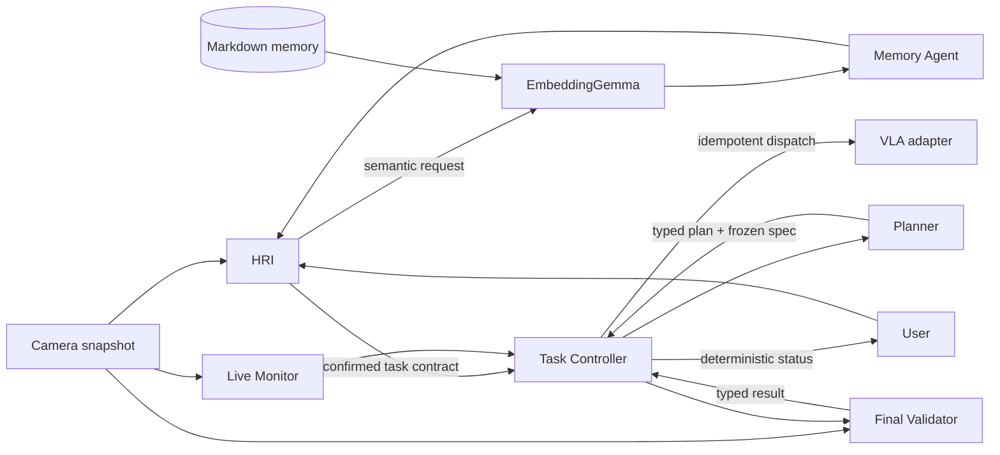

# RoboPref / PrefMem

PrefMem is a camera-grounded, preference-aware controller for tabletop robot
experiments. Language models interpret and plan; deterministic host code owns memory
writes, controller transitions, command publication, recovery budgets, and the final
completion gate.

Status: pre-alpha development (`2.0.0.dev0`).

## Runtime architecture



The Planner never receives persistent memory. It receives only the confirmed task
contract, the current frame, controller-owned plan/specification IDs, and bounded
recovery context. The Live Monitor sees only the active subtask and a short observation
window. The Validator sees the frozen validation specification and terminal evidence.
Plan-only, failure, safety, and final-validation statuses are rendered directly by host
code, so a presentation model cannot contradict the authoritative controller state.

## Services

Install the environment:

```console
uv sync
```

Serve EmbeddingGemma on port 8080. The client uses its native 768-dimensional output
without sending a `dimensions` request parameter, so the currently used command is
supported:

```console
vllm serve /data/models/embeddinggemma-300m --dtype bfloat16 \
  --hf_overrides '{"matryoshka_dimensions": 768}' \
  --port 8080
```

For reduced Matryoshka dimensions, serve an explicit list and a stable model name:

```console
vllm serve /data/models/embeddinggemma-300m --dtype bfloat16 \
  --served-model-name embeddinggemma-300m \
  --hf-overrides '{"matryoshka_dimensions":[128,256,512,768]}' \
  --port 8080
```

Expose the cloud agent model through the existing SSH tunnel:

```console
ssh -N -L 8000:127.0.0.1:8000 \
  -p 17756 -i ~/.ssh/id_ed25519 \
  root@103.196.86.98
```

Run the camera server:

```console
uv run stream_camera --port 1234
```

The expected endpoints are:

- Agent model: `http://127.0.0.1:8000/v1`
- EmbeddingGemma: `http://127.0.0.1:8080/v1`
- Camera frame: `http://127.0.0.1:1234/snapshot.jpg`

## Run PrefMem

Start an interactive, replay-recorded session against the tunnelled vLLM model:

```console
uv run prefmem \
  --model-provider vllm \
  --model /workspace/models/gemma-4-26B-A4B-it \
  --model-base-url http://127.0.0.1:8000/v1 \
  --embedding-base-url http://127.0.0.1:8080/v1 \
  --camera-url http://127.0.0.1:1234/snapshot.jpg \
  --record-context \
  --interactive
```

Useful checks for the described live scene are:

```text
What objects are visible, and where are they?
Place the banana inside the mug.
```

The second request produces a grounded plan by default. Plan-only mode never publishes
a VLA command and never claims that the physical scene changed.

Run one request and exit:

```console
uv run prefmem \
  --model-provider vllm \
  --query "What is on the left, in the middle, and on the right?" \
  --record-context
```

## Experiment recording

`--record-context` creates:

```text
recordings/<timestamp-and-id>/
├── session.md
└── frames/
    ├── frame-00001-hri-input.jpg
    ├── frame-00002-dispatch-subtask-001.jpg
    └── ...
```

`session.md` is append-only during a run and includes:

- runtime configuration;
- user and PrefMem messages;
- every complete system prompt and model input;
- parsed and raw model responses;
- memory retrieval candidates/results;
- controller transitions, plans, dispatch receipts, monitoring, and validation;
- links to every frame read into the system.

Image base64 is replaced by local Markdown links, keeping the transcript readable.
Recordings can contain sensitive camera and conversation data and should be handled
accordingly. Use `--recording-dir PATH` and `--recording-name NAME` to control output.

## Markdown memory

The default user-isolated files are:

```text
.prefmem/memory/<username>/preferences.md
.prefmem/memory/<username>/preferences.history.md
```

They contain validated `prefmem-preference` and `prefmem-episode` fenced records. The
Markdown is authoritative; embeddings are rebuildable retrieval data.
Authorized writes suppress exact duplicates and only suppress a near-duplicate when
metadata matches, lexical equivalence is high, and EmbeddingGemma cosine similarity is
at least `0.995`; an unavailable embedding service never blocks the canonical write.

Interactive memory commands are:

```text
/remember For future drink tasks, use the mug on the right.
/preferences
/forget pref-<id>
```

Natural future-facing requests such as “remember that I prefer…” are routed through
HRI and semantic memory retrieval. Host code commits a durable change only when the
current message or a dedicated memory-consent answer explicitly authorizes it.

Use a different canonical preference file with:

```console
uv run prefmem --preference-store runs/alice/preferences.md --username alice
```

## External VLA execution

Physical execution is opt-in because an agent-model response is not a robot-control
interface. Configure a JSONL queue consumed by an external VLA:

```console
uv run prefmem \
  --model-provider vllm \
  --execute \
  --vla-command-file runtime/vla-commands.jsonl \
  --record-context \
  --interactive
```

Each command contains exactly one short-horizon instruction and its dispatch-time
frame. The JSONL adapter indexes the existing queue when it starts, so publication
of identical dispatch IDs is suppressed across process restarts, while reuse of an
ID for different content is rejected. After publication, PrefMem observes the
camera and requires repeated local-success confirmation. If the current dispatch
fails, needs user assistance, is replaced by replanning, or triggers a safety abort,
the controller asks the adapter to cancel it before stopping or continuing.

JSONL cancellation requests use `message_type: "CANCEL"` and include the target
`dispatch_id`, a reason, and a timestamp. A cancellation receipt means the adapter
accepted or durably queued the request; it does not prove that physical motion has
already stopped. Adapters without cancellation support return an explicit
unsupported receipt. The independent Validator is still the only component that
can authorize reporting whole-task completion.

## Offline frames and tests

Use an ordered image directory instead of the live camera:

```console
uv run prefmem \
  --model-provider vllm \
  --frame-source dataset \
  --dataset dataset/v3 \
  --query "Describe the task state."
```

Run the offline unit/integration suite:

```console
uv run python -m unittest discover -s tests -v
```
